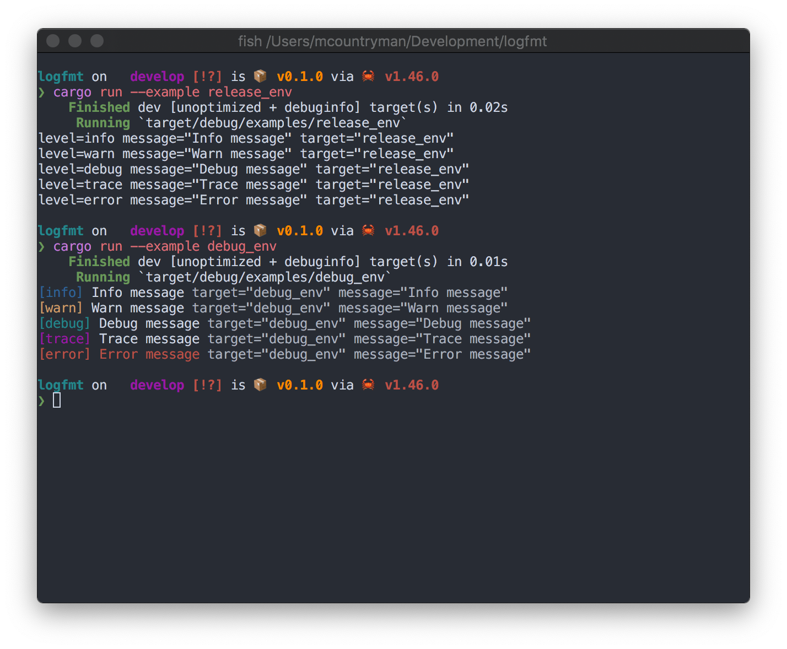

<h1 align="center">logfmt_logger</h1>
<p align="center">
  <a href="https://docs.rs/logfmt_logger">
    </img>
  </a>
  <a href="https://crates.io/crates/logfmt_logger">
    </img>
  </a>
</p>

Logger based off of env_logger using Heroku's [logfmt](https://brandur.org/logfmt) as an
output format.

### Preview


### Quick Start
> `Cargo.toml`
```toml
logfmt_logger = "0.0.1"
```

> `src/main.rs`
```rust
use std::env;
use logfmt_logger;

fn main() {
  env::set_var("RUST_LOG", "trace");
  logfmt_logger::init();
}
```
